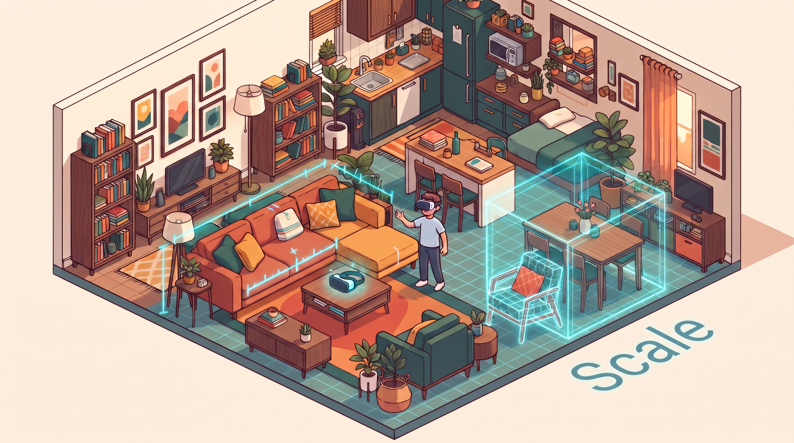

<p align="center">
  
</p>

<h1 align="center">Scale</h1>

<p align="center">
  <strong>Make the physical world computable.</strong>
</p>

<p align="center">
  Point at something you like. Scale finds real products like it, figures out what actually fits,
  reconstructs missing 3D geometry, and places the result in your room at true scale.
</p>

<p align="center">
  Built at <strong>Hack the North 2026</strong>.
</p>

---

## The idea

Most spatial shopping tools start with a catalog.

Scale starts with **the physical world**.

A desk in your parents' basement, a chair at a café, something on Marketplace, or a product with photos but no 3D asset should still be usable spatially.

We built Scale around one question:

> **"Find me something like this that actually fits here."**

Answering that requires more than recommendation.

Scale has to understand:

* what the user likes
* what physically exists in the room
* how much space is actually available
* which product dimensions can be trusted
* whether a candidate fits
* how to reconstruct it in 3D if no model exists
* how to preserve the exact product identity through checkout

The result is one system that connects **perception, retrieval, geometry, optimization, XR, and commerce** around the same physical object.

---

## How it works

```text
room + object
     ↓
RoomPlan / LiDAR
     ↓
image or natural-language query
     ↓
multimodal retrieval + Shopify discovery
     ↓
verified physical dimensions
     ↓
deterministic fit check
     ↓
2D → 3D reconstruction if needed
     ↓
metric mesh binding + validation
     ↓
1:1 placement in Quest
     ↓
exact product / variant / checkout
```

### 1. Capture reality

The iPhone app uses **Apple RoomPlan** to reconstruct the room in metres.

For individual objects, we built a custom **LiDAR raycast-and-grow measurement path** that returns width, height, depth, position, and rotation.

Physical size is measured deterministically.

**We never ask a language model to guess it.**

For objects you already own, Scale can also run **Apple Object Capture** and export a textured mesh into the same spatial system.

### 2. Search by meaning

Scale supports both text and image retrieval.

You can type:

> "soft beige reading chair"

or use something you already own as the visual reference.

We use **SigLIP2** so text and product images share the same 768-dimensional embedding space.

Similarity answers:

> *What looks right?*

The room answers:

> *What is physically possible?*

### 3. Search real Shopify products

Scale also connects to **Shopify Global Catalog** for real text, image, and multimodal product discovery.

Shopify gives us:

* the merchant
* the real product
* the exact variant
* price
* availability
* checkout identity

Scale adds the part commerce normally does not know:

> **the customer's physical environment**

A product only receives a verified fit result when Scale has dimensions with trustworthy provenance.

Otherwise it stays:

> **SIZE UNVERIFIED**

In one live verification with a **50 cm width constraint**:

| Product               | Result                         |
| --------------------- | ------------------------------ |
| Terrazzo Side Table   | **0.8 cm too wide**            |
| Terrazzo Switch Table | **fits with 4.3 cm clearance** |

The fitting result retained its real Shopify merchant, variant, price, and checkout destination.

So Scale can move from:

> **"This looks right."**

to:

> **"This looks right, fits here, and this is the exact one you can buy."**

### 4. Reconstruct missing 3D

Most products have photos.

Far fewer have usable 3D assets.

Scale sends a single product image through **Stable Fast 3D on Baseten**.

But generated geometry has no trustworthy physical scale.

That led to one of the main rules in the system:

> **The generative model supplies shape. The measurement supplies size.**

Our binding pipeline:

1. parses the generated mesh
2. computes the scale required to match the target physical dimensions
3. transforms the geometry
4. preserves UVs and materials
5. preserves or reconstructs normal-map tangent data
6. moves the origin to bottom-centre
7. exports the GLB
8. reloads the exported bytes
9. verifies the final bounding box and origin

**We do not even trust our own export step.**

Scale is applied exactly once. Every downstream system treats that result as canonical.

### 5. Put it in the room

Captured objects, generated objects, and catalog products all use the same metre-based room coordinate system.

On iPhone, Scale supports 3D and AR previews for captured objects.

On Meta Quest, you can stand inside the room at **1:1 scale**, grab furniture, move it, rotate it, and understand the layout spatially rather than through a flat product page.

When final geometry is not ready, Scale can represent the object's measured volume first instead of blocking the interaction on generation.

### 6. Ask the room to change

Scale also accepts natural-language spatial requests:

> "Find me a lamp under 1.5 metres."

> "Turn this bedroom into a six-person workspace."

The language model interprets intent.

It **does not place the furniture**.

Scale converts the request into an objective and constraints, then **OR-Tools** solves the actual placement.

> **The LLM never emits a coordinate.**

Every measurement spoken by the voice assistant must also trace back to a real tool result.

---

## What we proved

|                     |                                                                                                           |
| ------------------- | --------------------------------------------------------------------------------------------------------- |
| **1.19 s**          | fastest measured repeated warm 1024-texture 2D → 3D request                                               |
| **2.62 s / 4.07 s** | two different new warm catalog-image requests                                                             |
| **0.94 s / 1.74 s** | SF3D compute inside those two requests                                                                    |
| **100 products**    | curated spatial catalog across five furniture categories                                                  |
| **262 products**    | dimensions recovered from merchant pages when product APIs did not expose them                            |
| **768 dimensions**  | shared SigLIP2 image/text embedding space                                                                 |
| **0.8 cm → 4.3 cm** | real Shopify miss versus verified fitting alternative                                                     |
| **< 3 × 10⁻⁸ m**    | measured numerical bounding-box error against supplied target dimensions in our real GLB binding artifact |

The important part is not any one model.

It is that **every representation eventually has to agree about the same physical object**.

---

## Architecture

<p align="center">
  
</p>

Scale uses Cloudflare as the shared control plane between the iPhone, Quest, persistent room state, search, generation, and the external services behind them.

| Piece              | Where             | Role                                                                         |
| ------------------ | ----------------- | ---------------------------------------------------------------------------- |
| `apps/mobile`      | iPhone            | Room capture, object measurement, Object Capture, library and room selection |
| `apps/xr`          | Meta Quest        | 1:1 room runtime, physics, interaction, voice, products and placement        |
| `workers`          | Cloudflare Worker | Main API and routing layer                                                   |
| D1                 | Cloudflare        | Rooms, objects and application state                                         |
| R2                 | Cloudflare        | Meshes, frames and generated assets                                          |
| Vectorize          | Cloudflare        | 768-d SigLIP2 embeddings                                                     |
| Queues + Workflows | Cloudflare        | Long-running ingestion and generation jobs                                   |
| Durable Objects    | Cloudflare        | Per-room synchronization and live state                                      |
| `services/agent`   | Cloudflare Worker | Intent → objectives and constraints                                          |
| `services/fit`     | Docker            | Fit validation + OR-Tools CP-SAT arrangement                                 |
| `services/ingest`  | Docker            | Merchant crawl, Browserbase reads, dimension extraction                      |
| `services/search`  | Docker            | Retrieval and ranking                                                        |
| `services/gen`     | Docker + Baseten  | Embeddings, SF3D generation, metric binding and validation                   |

`docs/SYSTEM_STATE.md` describes the current runtime state.

`.claude/contracts.md` defines the shared schemas and routes.

---

## Under the hood

### Trustworthy dimensions

**Shopify · Browserbase · regex · LLM/VLM extraction**

Furniture dimensions are surprisingly messy.

They can appear in:

* `body_html`
* variant names such as `60" x 30"`
* JSON-LD
* specification tables
* Shopify metafields unavailable through storefront product endpoints
* diagrams
* mixed imperial and metric units
* or nowhere at all

Scale escalates through progressively more expensive sources:

```text
structured data / regex
        ↓
constrained LLM extraction
        ↓
rendered page through Browserbase
        ↓
VLM over specification imagery
        ↓
shared validator
```

Every answer goes through the same validation layer.

It checks:

* stated units
* plausible ranges
* swapped axes
* product-category consistency
* source provenance
* confidence

Unknown means unknown.

Rendering merchant pages recovered physical dimensions for **262 products** that the normal product API layer did not expose.

---

### Multimodal retrieval

**SigLIP2 · Cloudflare Vectorize**

Scale uses:

```text
google/siglip2-base-patch16-224
```

for both images and text.

Both produce normalized **768-dimensional embeddings**, allowing natural-language intent to be compared directly against product photography.

Physical dimensions remain separate hard constraints.

---

### Shopify spatial commerce

**Shopify Global Catalog**

Shopify discovery is isolated from Scale's existing retrieval path.

Scale can search using:

* text
* an image
* image + text
* a related product

A returned commerce result can carry its real seller, variant, price, availability, and checkout URL.

Scale does not treat inferred product descriptions as dimensional truth.

Only products joined to sufficiently trustworthy physical evidence receive a verified fit.

If Shopify is unavailable, the original catalog, search, fit, generation, and XR paths continue independently.

---

### 2D → 3D

**Stable Fast 3D · Baseten**

SF3D produces geometry and textures from one image.

Scale then binds the output to physical dimensions.

The generation layer owns **appearance**.

The binding layer owns **scale**.

During profiling, we found that the expensive part of the path was not steady-state inference but startup and first-request initialization.

Our controlled same-replica benchmark went from **28.71 s on the first request** to **1.19 s on the next 1024-texture request**.

Reducing texture resolution barely improved total latency and visibly reduced detail, so we kept the higher-quality setting.

For demo reliability, reviewed meshes can be served from cache without making the judged path depend on GPU cold-start behavior.

---

### Spatial reasoning

**Deterministic fit checks · OR-Tools**

The LLM is allowed to understand:

> "make this corner a reading space"

It is not allowed to decide that a 90 cm table fits inside an 80 cm gap.

Deterministic systems answer:

* does it fit?
* which constraint failed?
* by how much?
* how much clearance remains?
* where can it legally go?

That is how Scale can produce:

> **0.8 cm too wide**

instead of asking a model whether something *looks* like it fits.

---

## The two apps

### iPhone

**Expo · Expo Router · four custom Swift modules · RoomPlan · ARKit**

The phone handles:

* RoomPlan room capture
* LiDAR object measurement
* Apple Object Capture
* native USDZ → glTF export
* SceneKit preview
* QuickLook AR
* room and object library
* room handoff to Quest

<details>
<summary><strong>Additional room capture path</strong></summary>

Scale can also reconstruct a box-room representation from six rectified surface photographs.

Each face is straightened with a four-point transform. LiDAR corner measurements or an entered ceiling height establish the physical scale, and the surfaces are assembled into the room representation.

</details>

### Meta Quest

**WebXR · three.js · Rapier · ElevenLabs**

The Quest experience includes:

* the scanned room at 1:1
* physics-enabled furniture
* grab, carry, rotate, lift and place
* a persistent floating product/library window
* live room updates over SSE
* hold-to-talk voice interaction
* live product results
* true-scale catalog meshes
* newly captured phone objects without a page reload

---

## Built with

| Area                      | Technology                                                              |
| ------------------------- | ----------------------------------------------------------------------- |
| **Capture**               | Apple RoomPlan, ARKit/LiDAR, Object Capture, Swift, Expo                |
| **Retrieval**             | SigLIP2, Cloudflare Vectorize                                           |
| **Commerce**              | Shopify Global Catalog                                                  |
| **Merchant intelligence** | Shopify storefronts, Browserbase, OpenAI                                |
| **3D generation**         | Stable Fast 3D, Baseten                                                 |
| **Spatial reasoning**     | OR-Tools, deterministic fit validation                                  |
| **Edge + state**          | Cloudflare Workers, D1, R2, KV, Queues, Workflows, Durable Objects, SSE |
| **XR**                    | three.js, WebXR, Rapier                                                 |
| **Voice**                 | ElevenLabs                                                              |
| **Services**              | FastAPI, Docker                                                         |

---

## Repository

```text
apps/
  mobile/            Expo app + native Swift capture / measurement
  xr/                Quest WebXR runtime

workers/              Cloudflare API + orchestration

services/
  agent/              designer agent
  fit/                deterministic fit + OR-Tools solver
  ingest/             merchant crawl + dimension extraction
  search/             retrieval / ranking
  gen/                embeddings + SF3D + metric binding

fixtures/             committed API fixtures
infra/                Docker, tunnels, provisioning and publish tooling
docs/                 architecture, system state and runbooks
```

---

<details>
<summary><strong>Run Scale locally</strong></summary>

### Prerequisites

* Xcode 26+
* LiDAR-equipped iPhone (12 Pro or newer)
* Meta Quest with developer mode
* Node
* Docker Desktop
* `cloudflared`

### iPhone

```bash
cd apps/mobile
npm install
npx expo run:ios --device
```

### Quest

```bash
cd apps/xr
npm install
npm run quest
```

`npm run quest` sets up ADB reverse and starts Vite at:

```text
http://localhost:5173
```

Open the address in the Quest browser over USB and enter VR.

### Edge + services

```bash
cp infra/.env.example infra/.env
# Fill in the required upstream token.

bash infra/up.sh

cd services/agent
npm run dev
```

Every `/v1` route can also return committed fixture responses when supplied:

```text
X-Stub: 1
```

so the clients can be developed independently of the complete live stack.

</details>

---

## Team

**Built at Hack the North by four engineers working in parallel against shared contracts and explicit component ownership.**

### Thomas

**iOS capture + backend infrastructure**

* RoomPlan room scanning
* LiDAR object measurement
* Expo integration
* Cloudflare API
* D1 / R2 / Vectorize / KV
* generation and merchant-ingest workflows
* catalog/search routes
* Docker, tunnels and provisioning
* WebXR room-selection and panel work alongside Justin

### Justin

**Spatial runtime + reasoning**

* Quest WebXR runtime
* three.js scene and interaction
* Rapier physics
* HUD, voice and product panels
* ElevenLabs integration
* OR-Tools CP-SAT solver
* `services/fit`
* designer agent and planning pipeline
* native wall/object capture
* Expo room flows

### Ani

**Multimodal ML + 3D generation + spatial commerce**

* SigLIP2 text/image embedding service
* Stable Fast 3D deployment on Baseten
* generation profiling and latency instrumentation
* metric GLB binding and validation
* UV / material / normal-map / tangent preservation
* Shopify Global Catalog discovery
* exact-variant dimension verification
* physical-fit explanations and checkout handoff
* Cloudflare generation dispatch and indexing integration

### Paul

**Merchant intelligence + ranking + mobile voice**

* Shopify crawling and extraction
* Browserbase merchant-page processing
* dimension extraction and validation
* spatial catalog ingestion
* 100-product prebaked catalog
* `services/search`
* mobile voice intent parsing
* tool schema and agent transport

---

## The rules we kept coming back to

> **Shape can be generated. Scale must be measured.**

> **Similarity does not imply fit.**

> **The LLM understands intent. Deterministic systems own geometry.**

> **If we do not know a measurement, we say we do not know it.**

> **Every representation eventually has to agree about the same physical object.**

---

For the full system design and the reasoning behind it, see [`BUILD_DOC.md`](BUILD_DOC.md).
